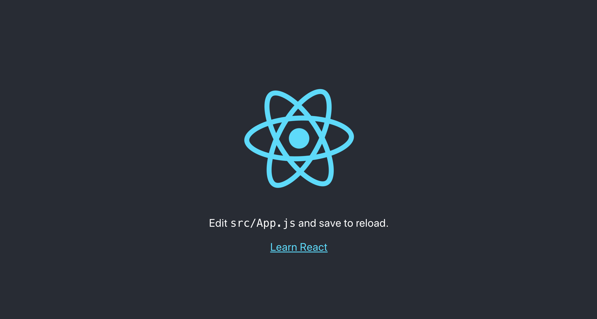
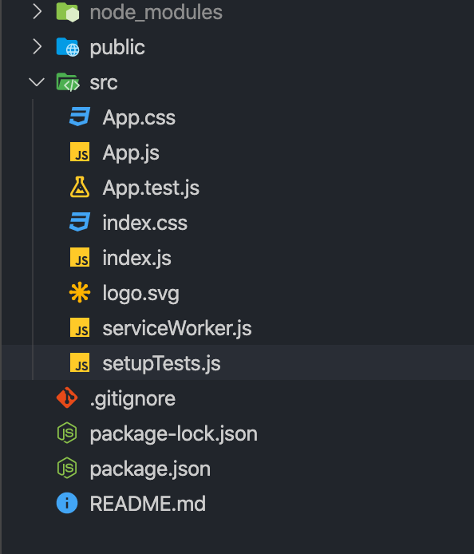
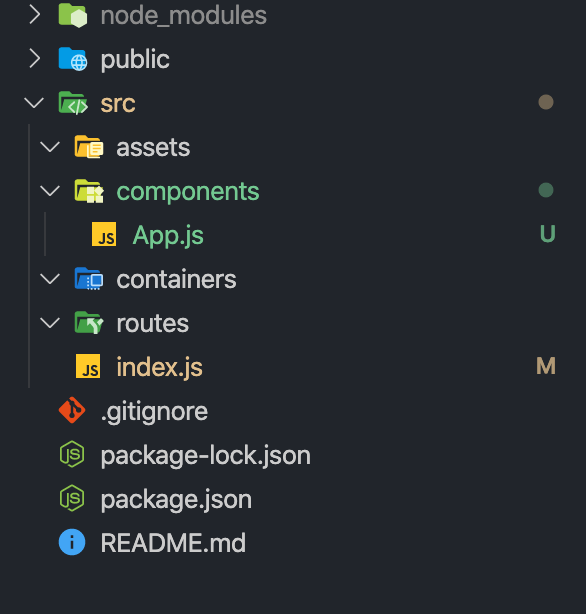
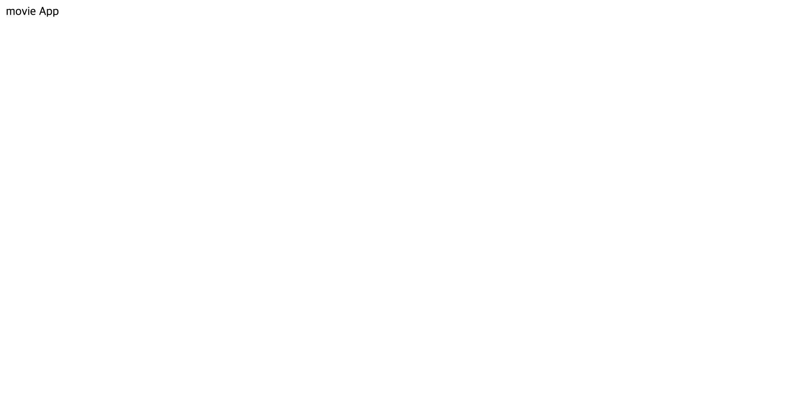
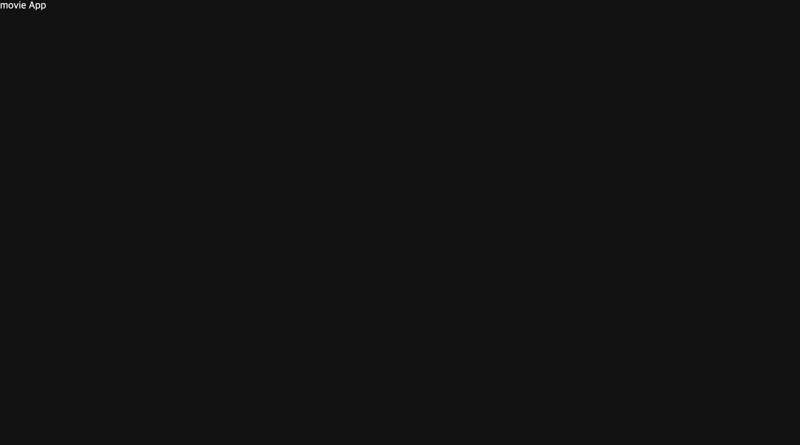

## React 프로젝트 만들기

react를 이용하여 영화 앱 만들기를 해보겠습니다.

```
$ npx create-react-app react-movie-app
```

으로 프로젝트를 생성해 주세요.

### 라이브러리 설치

프로젝트에 필요한 라이브러리를 설치하도록 하겠습니다. 이번 프로젝트에서는 styled-components , styled-reset , react-router-dom , react-icons 을 사용하겠습니다.

```
$ cd react-movie-app
$ npm i styled-components styled-reset react-icons react-router-dom
```

설치 후 터미널에서

```
$ npm start
```

를 해주면 http://localhost:3000/ 으로 아래와 같은 화면이 나오는 것을 확인 하실 수 있습니다.



영화 앱을 만들기 전 화면을 reset 시켜주고 작업을 하도록 하겠습니다.



src 안에 components , containers , routes , assets 폴더를 만들어 주고 index.js , App.js 빼고 나머지 파일을 삭제 한 다음 아래처럼 이미지처럼 만들어 주세요.



그 다음 **index.js , App.js** 를 아래와 같이 수정해 주세요.

```
// index.js

import React from 'react';
import ReactDOM from 'react-dom';
import App from './components/App';

ReactDOM.render(
  <React.StrictMode>
    <App />
  </React.StrictMode>,
  document.getElementById('root')
);

```

```
// App.js

import React from 'react';

function App() {
  return <div className="App">movie App</div>;
}

export default App;

```



위 이미지처럼 하얀색 배경에 movie App 텍스트가 나오면 성공입니다. 하지만 아지 margin , padding 등의 css 리셋이 되어있지 않는 상태입니다.

compoents 폴더 안에 GlobalStyles.js 파일을 만들어 주시고 아랴와 같이 입력해 주세요.

```
// GlobalStyles.js

import { createGlobalStyle } from 'styled-components';
import reset from 'styled-reset';
export const GlobalStyles = createGlobalStyle`
  ${reset};
  body {
    background-color: #121212;
    color: #fff;
    font-size: 15px;
    font-weight: 400;
    line-height: 1.65;
  }
`;

export const palette = {
  white: '#fff',
  black: '#000',
  gray1: '#24272b',
  gray2: '#272c34',
};


```

App.js 를 아래와 같이 수정해 주세요.

```
// App.js

import React from 'react';
import { GlobalStyles } from './GlobalStyles';
function App() {
  return (
    <>
      <GlobalStyles />
      <div>movie App</div>
    </>
  );
}

export default App;

```



위 이미지처럼 나오면 reset은 성공적으로 완료한 것입니다. 다음 편에 react-router-dom을 이용해서 페이지 이동 및 레이아웃을 꾸미도록 하겠습니다.
