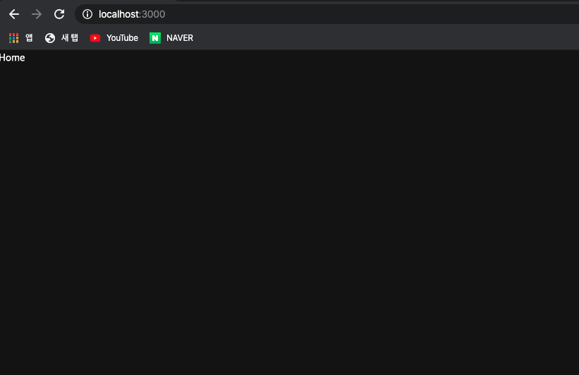
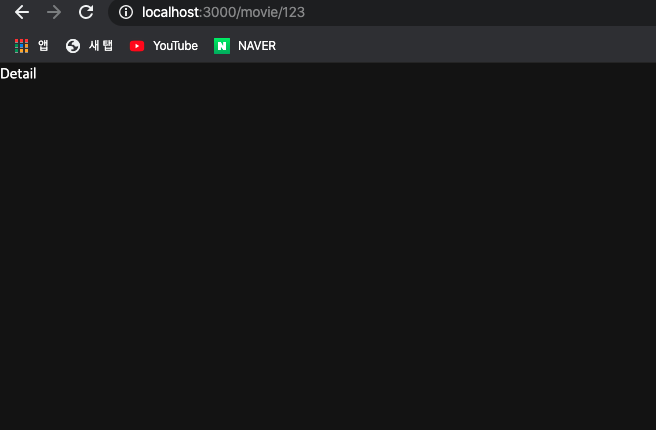
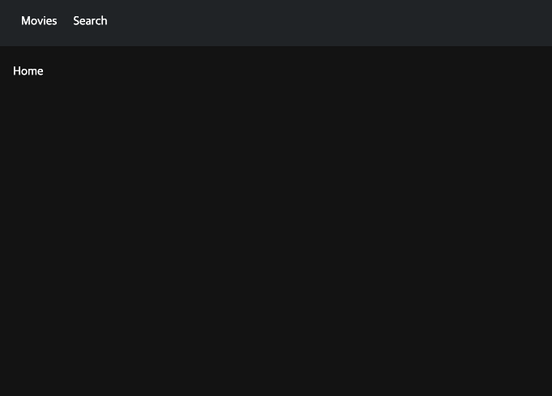

컴포넌트를 만들기 전 라우서 설정을 하도록 하겠습니다. 제가 만들 Movie App 에서는 3개의 페이지를 만들어 줄 것이며 그 설정을 하도록 하겠습니다.  
**routes** 폴더 안에 **Home.js, Search.js, Detail.js** 파일을 만들어 주시고 아래와 같이 입력해 주세요.

```
// Home.js

import React from 'react';
import styled from 'styled-components';

const Home = () => {
  return (
    <>
      <div>Home</div>
    </>
  );
};

export default Home;

```

```
// Search.js

import React from 'react';
import styled from 'styled-components';

const Search = () => {
  return (
    <>
      <div>Search</div>
    </>
  );
};

export default Search;

```

```
// Detail.js

import React from 'react';
import styled from 'styled-components';

const Detail = () => {
  return (
    <>
      <div>Detail</div>
    </>
  );
};

export default Detail;

```

작성이 완료 됐으면 routes 폴더에 index.js 파일을 만들어주어서 위에서 만든 파일들을 하나로 연결 하겠습니다.

```
// routes -> index.js

export { default as Home } from './Home';
export { default as Search } from './Search';
export { default as Detail } from './Detail';

```

그 다음으로 **components** 폴더 안에 **Router.js** 파일을 생성해 주고 아래와 같이 입력해 주세요.

```
// Router.js

import React from 'react';
import { BrowserRouter, Route, Redirect, Switch } from 'react-router-dom';
import { Home, Search, Detail } from '../routes';

const Router = () => {
  return (
    <BrowserRouter>
      <Switch>
        <Route path="/" exact component={Home}></Route>
        <Route path="/search" component={Search}></Route>
        <Route path="/movie/:id" component={Detail}></Route>
        <Redirect from="*" to="/"></Redirect>
      </Switch>
    </BrowserRouter>
  );
};

export default Router;


```

react-router-dom 라이브러리를 통해서 페이지를 생성할 수 있습니다. 다음으로 **App.js** 에서 불러와 보도록 하겠습니다.

```
// App.js

import React from 'react';
import { GlobalStyles } from './GlobalStyles';
import Router from './Router';
function App() {
  return (
    <>
      <GlobalStyles />
      <Router />
    </>
  );
}

export default App;

```

위와 같이 작성했다면 홈에서는 아래와 같이 Home 이라는 문구가 나옵니다.



다시 주소창에 '/search' 또는 '/movie/123' 으로 바꾸면 화면이 변하는 것을 알 수 있습니다.



만약 Router.js 에서 등록안한 주소로 이동을 하게 되면 라우터에서 설정한 **Redirect** 로 인해 홈으로 팅깁니다.

다음으로는 header 컴포넌트를 만들도록 하겠습니다. **components** 폴더 안에 **Header.js** 파일을 만들어 주시고 아래와 같이 입력해 주세요.

```
// Header.js

import React from 'react';
import styled from 'styled-components';
import { Link } from 'react-router-dom';
import { palette } from './GlobalStyles';

const HeaderBox = styled.header`
  width: 100%;
  height: 60px;
  position: fixed;
  top: 0;
  left: 0;
  z-index: 1000;
`;

const Nav = styled.nav`
  width: 100%;
  height: 100%;
  padding: 0 16px;
  box-sizing: border-box;
  background-color: ${palette.gray1};
`;

const ListUl = styled.ul`
  display: flex;
  align-items: center;
  height: 100%;
`;

const List = styled.li`
  a {
    color: ${palette.white};
    text-decoration: none;
    display: block;
    padding: 0 10px;
  }
`;

const Header = () => {
  return (
    <>
      <HeaderBox>
        <Nav>
          <ListUl>
            <List>
              <Link to="/">Movies</Link>
            </List>
            <List>
              <Link to="/search">Search</Link>
            </List>
          </ListUl>
        </Nav>
      </HeaderBox>
    </>
  );
};

export default Header;

```

위와 같이 작서을 하셨다면 **Router.js** 에서 Header 컴포넌트를 불어와 주세요.

```
// Router.js

import React from 'react';
import { BrowserRouter, Route, Redirect, Switch } from 'react-router-dom';
import { Home, Search, Detail } from '../routes';
import Header from './Header';

const Router = () => {
  return (
    <BrowserRouter>
      <Header />
      <Switch>
        <Route path="/" exact component={Home}></Route>
        <Route path="/search" component={Search}></Route>
        <Route path="/movie/:id" component={Detail}></Route>
        <Redirect from="*" to="/"></Redirect>
      </Switch>
    </BrowserRouter>
  );
};

export default Router;

```

그러면 화면에 header 가 생기면서 페이지 이동이 가능합니다. 하지만 header 컴포넌트가 position: fixed 로 되어 있기 때문에 뒤에 글씨가 안보이는 것을 알 수 있습니다.

이 현상을 해결하기 위해 공통 레이아웃을 만들고 그 레이아웃에 위아래 padding 을 줘서 화면의 글씨가 나오도록 하겠습니다.

**components** 안에 **Layout.js** 파일을 만들어 주시고 아래와 같이 입력해 주세요.

```
// Layout.js

import React from 'react';
import styled from 'styled-components';
import Router from './Router';

const Main = styled.main`
  padding: 80px 16px;
  box-sizing: border-box;
`;

const Layout = () => {
  return (
    <>
      <Main>
        <Router />
      </Main>
    </>
  );
};

export default Layout;

```

위와 같이 작성을 하셨다면 **App.js** 를 아래와 같이 수정해 주세요.

```
// App.js

import React from 'react';
import { GlobalStyles } from './GlobalStyles';
import Layout from './Layout';

function App() {
  return (
    <>
      <GlobalStyles />
      <Layout />
    </>
  );
}

export default App;

```



위 화면처럼 header 가 나타나고 Home 이라는 글씨가 나오면 성공입니다.
