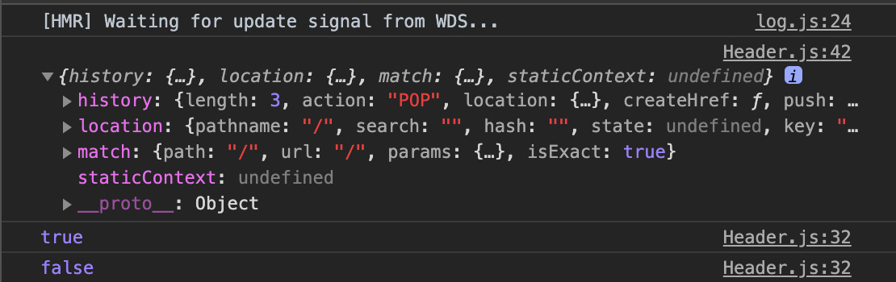

## 리스트 컴포넌트 만들기

list 컴포넌트를 만들기 전에 header 컴포넌트를 조금 수정하도록 하겠습니다. 수정할 내용은 url 이 header의 이름과 같다고 하면 해당 li 의 색을 변하도록 만들겠습니다. 우선 **Header.js** 를 아래처럼 수정해 주세요.

```
// Header.js

import React from 'react';
import styled, { css } from 'styled-components';
import { Link, withRouter } from 'react-router-dom';
import { palette } from './GlobalStyles';

const HeaderBox = styled.header`
  width: 100%;
  height: 60px;
  position: fixed;
  top: 0;
  left: 0;
  z-index: 1000;
`;

const Nav = styled.nav`
  width: 100%;
  height: 100%;
  padding: 0 16px;
  box-sizing: border-box;
  background-color: ${palette.gray1};
`;

const ListUl = styled.ul`
  display: flex;
  align-items: center;
  height: 100%;
`;

const List = styled.li`
  ${(props) => console.log(props.path)}
  /* ${(props) => {
    if (props.path) {
      return css`
        border-bottom: 1px solid red;
      `;
    }
  }} */
  a {
    color: ${palette.white};
    text-decoration: none;
    display: block;
    padding: 0 10px;
    opacity: ${(props) => (props.path ? 1 : 0.5)};
  }
`;

const Header = (props) => {
  console.log(props);
  return (
    <>
      <HeaderBox>
        <Nav>
          <ListUl>
            <List path={props.location.pathname === '/'}>
              <Link to="/">Movies</Link>
            </List>
            <List path={props.location.pathname === '/search'}>
              <Link to="/search">Search</Link>
            </List>
          </ListUl>
        </Nav>
      </HeaderBox>
    </>
  );
};

export default withRouter(Header);


```

위 코드에서 봐야 할 점은 **import { Link, withRouter } from 'react-router-dom'** 이 부분입니다. 이전에 **Router.js** 에서 **Header** 컴포넌트를 **BrowserRouter** 안에 불러왔습니다. 그러면 Header 컴포넌트에서 withRouter 쓸 수 있게 됩니다. withRouter 불러와 밑에 **export default withRouter(Header)** 형식으로 감씨주게 되면 props 안에 url 정보를 받을 수 있게 됩니다.



콘솔창을 보면 정보가 나와 있고 path={props.location.pathname === '/'} 에서 현재 url 정보로 true , false 값을 줄 수 있습니다. 그 정보를 위 styled-components 로 만든 **List** 안에 props 로 불러와 css 를 수정 할 수 있습니다.


위 화면처럼 header 부분이 수정됬으면 성공한 것 입니다.

Header.js 에 있는 콘솔들은 주석 처리 해 주시고 이제 영화 리스트를 보여줄 컴포넌트를 만들도록 하겠습니다. 그 전에 [팝콘이미지](https://unsplash.com/s/photos/popcorn) 여기서 팝콘 이미지 아무거나 받아주세요.


저는 위 이미지를 다운받아 **assets** 폴더안에 넣었습니다. 이제 **compoents** 폴더 안에 **ItemList.js** 파일을 만들어 주시고 아래와 같이 입력해 주세요.

```
// ItemList.js

import React from 'react';
import styled from 'styled-components';
import { Link } from 'react-router-dom';
import { palette } from './GlobalStyles';
import popcorn from '../assets/popcorn.jpg';

const ItemContainer = styled.div`
  background-color: ${palette.gray2};
  border-radius: 10px;
  transition: transform 0.2s;
  overflow: hidden;
  a {
    text-decoration: none;
  }
  &:hover {
    transform: translateY(-10px);
  }
`;

const ImageBox = styled.div`
  width: 100%;
  position: relative;
  &:before {
    content: '';
    display: block;
    padding-bottom: 56.25%;
  }
  img {
    position: absolute;
    left: 0;
    top: 0;
    display: block;
    width: 100%;
    height: 100%;
    object-fit: cover;
  }
`;

const TitleBox = styled.div`
  padding: 10px;
  box-sizing: border-box;
`;

const Title = styled.h3`
  font-size: 18px;
  color: ${palette.white};
`;

const ItemList = () => {
  return (
    <>
      <ItemContainer>
        <Link to="/">
          <ImageBox>
            
          </ImageBox>
          <TitleBox>
            <Title>영화제목</Title>
          </TitleBox>
        </Link>
      </ItemContainer>
    </>
  );
};

export default ItemList;


```

위와 같이 작성하셨다면 **containers** 폴더에 **HomePage.js** 파일을 만들어 주시고 아래와 같이 입력해 주세요.

```
// HomePage.js

import React from 'react';
import styled from 'styled-components';
import ItemList from '../components/ItemList';

const ListBox = styled.ul`
  display: flex;
  flex-wrap: wrap;
`;

const List = styled.li`
  width: 100%;
  padding: 10px;
  box-sizing: border-box;
  @media screen and (min-width: 768px) {
    width: 33.33%;
  }

  @media screen and (min-width: 1200px) {
    width: 25%;
  }
`;

const HomePage = () => {
  return (
    <>
      <ListBox>
        <List>
          <ItemList />
        </List>
        <List>
          <ItemList />
        </List>
        <List>
          <ItemList />
        </List>
        <List>
          <ItemList />
        </List>
        <List>
          <ItemList />
        </List>
      </ListBox>
    </>
  );
};

export default HomePage;

```

그 다음에 **Home.js** 를 아래오 같이 수정해 주세요.

```
// Home.js

import React from 'react';
import HomePage from '../containers/HomePage';

const Home = () => {
  return (
    <>
      <HomePage />
    </>
  );
};

export default Home;

```

이제 화면을 확인하시면 아래 이미지 처럼 pc화면 mobile화면 모두 정상적으로 나오는 것을 확인 할 수 있습니다.


이것으로 list 컴포넌트를 완성하였고 다음으로 데이터를 불러와 실제 영화 정보를 보여주도록 하겠습니다.
