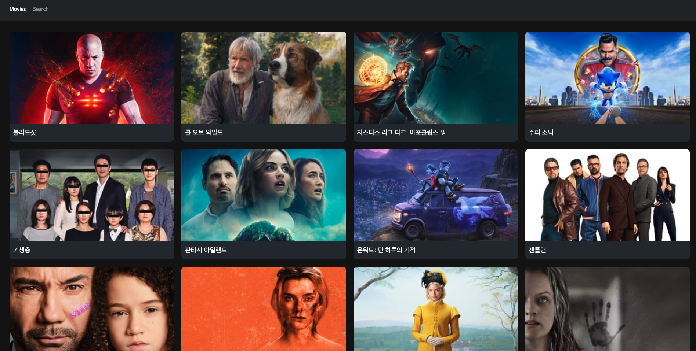

영화리스트를 불러오기 위해 axios 를 설치하고 axios를 통해 데이터를 불러오도록 하겠습니다. **npm i axios** 를 해주세요. 설치가 완료 됐으면 **src** 폴더안에 **api.js** 파일을 만들어 주세요. 영화의 데이터는 [바로가기](https://www.themoviedb.org/) 에서 회원가입을 하시고 프로필 설정 -> API 에서 API 키를 받을 수 있습니다.  
**api.js** 를 아래와 같이 입력해 주세요.

```
// api.js

import axios from 'axios';

axios.defaults.baseURL = 'https://api.themoviedb.org/3/';

export const movieGet = () => {
  // 서버에 요청을 보냄
  return axios.get('/movie/now_playing', {
    params: {
      api_key: '받은 API 키를 입력해 주세요.',
      language: 'ko',
    },
  });
};

```

위와 같이 작성을 하셨다면 **HomePage.js** 에서 불러와 보도록 하겠습니다.

```
// HomePage.js

import React, { useState, useEffect } from 'react';
import styled from 'styled-components';
import { movieGet } from '../api';
import ItemList from '../components/ItemList';

const ListBox = styled.ul`
  display: flex;
  flex-wrap: wrap;
`;

const List = styled.li`
  width: 100%;
  padding: 10px;
  box-sizing: border-box;
  @media screen and (min-width: 768px) {
    width: 33.33%;
  }

  @media screen and (min-width: 1200px) {
    width: 25%;
  }
`;

const HomePage = () => {
  const [lists, setLists] = useState('');
  const getList = async () => {
    const res = await movieGet();
    console.log(res);
    setLists(res.data.results);
  };
  useEffect(() => {
    getList();
  }, []);
  console.log(lists);

  return (
    <>
      <ListBox>
        {lists.length >= 1 &&
          lists.map((data) => (
            <List key={data.id}>
              <ItemList data={data} />
            </List>
          ))}
      </ListBox>
    </>
  );
};

export default HomePage;

```

위와 같이 작성을 했으면 화면에 리스트가 20개 뿌려진겻을 확인 할 수 있습니다. 위에서 주목해야 할 것은 **useState** 와 **useEffect** 입니다. 맨 처음 화면이 로딩되면 lists 에는 빈값이 있다가 getList 함수가 실행이 되고 그 안에서 axios로 데이터를 불러오게 되면 setLists로 데이터 값을 넘겨 줍니다. 그리고 useEffect 는 처름 로딩 될 때 한번만 실행하게 됩니다.

**ItemList** 에는 데이터 값을 넘겨줘서 영화 제목, 링크, 이미지를 나타내도록 만들겠습니다.

```
// ItemList.js

import React from 'react';
import styled from 'styled-components';
import { Link } from 'react-router-dom';
import { palette } from './GlobalStyles';
import popcorn from '../assets/popcorn.jpg';

const ItemContainer = styled.div`
  background-color: ${palette.gray2};
  border-radius: 10px;
  transition: transform 0.2s;
  overflow: hidden;
  a {
    text-decoration: none;
  }
  &:hover {
    transform: translateY(-10px);
  }
`;

const ImageBox = styled.div`
  width: 100%;
  position: relative;
  &:before {
    content: '';
    display: block;
    padding-bottom: 56.25%;
  }
  img {
    position: absolute;
    left: 0;
    top: 0;
    display: block;
    width: 100%;
    height: 100%;
    object-fit: cover;
  }
`;

const TitleBox = styled.div`
  padding: 10px;
  box-sizing: border-box;
`;

const Title = styled.h3`
  font-size: 18px;
  color: ${palette.white};
`;

const ItemList = (props) => {
  return (
    <>
      <ItemContainer>
        <Link to={`/movie/${props.data.id}`}>
          <ImageBox>
            {props.data.backdrop_path ? (
              
            ) : (
              
            )}
          </ImageBox>
          <TitleBox>
            <Title>{props.data.title}</Title>
          </TitleBox>
        </Link>
      </ItemContainer>
    </>
  );
};

export default ItemList;

```



위 이미지 처럼 영황의 제목과 이미지가 바뀌어 있고 리스트를 클릭하면 화면이 디테일 페이지로 바뀌고 url 이 '/movie/454626' 이런식으로 바뀌는 것을 확인 할 수 있습니다. 다음에는 영화의 디테일 페이지를 작업하도록 하겠습니다.
