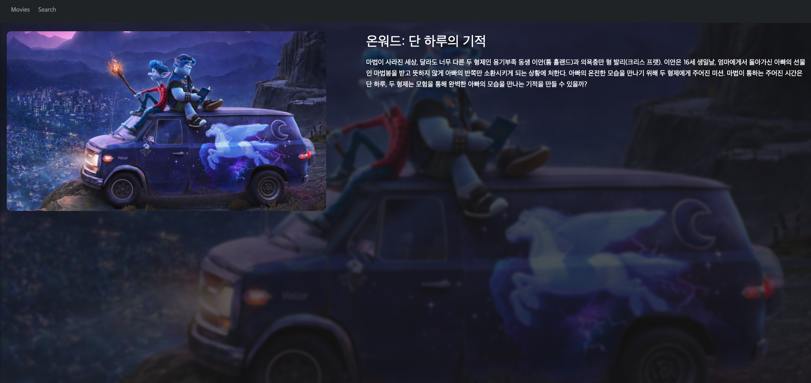

디테일 페이지를 만들어 주도록 하겠습니다. containers 폴더에 **DetailPage.js** 파일을 만들어 주고 아래와 같이 입력해 주세요.

```
// DetailPage.js
import React from 'react';
import { withRouter } from 'react-router-dom';

function DetailPage(props) {
  console.log(props.match.params.id);
  return (
    <>
      <div>디테일 페이지</div>
    </>
  );
}

export default withRouter(DetailPage);
```

**react-router-dom** 의 기능으로 withRouter로 감싸주면 props로 params를 받을 수 있습니다. 콘솔을 확인해 보시면 주소창에 있는 아이디 값이 나오는 것을 확인 하실 수 있습니다. 이 다음으로 axios 를 이용해서 해당 id 값의 영화를 가지고 오도록 하겠습니다. api.js 파일을 아래와 같이 수정해 주세요.

```
// api.js

import axios from 'axios';

axios.defaults.baseURL = 'https://api.themoviedb.org/3/';

export const movieGet = () => {
  // 서버에 요청을 보냄
  return axios.get('/movie/now_playing', {
    params: {
      api_key: '받은 API 키를 입력해 주세요.',
      language: 'en-US',
    },
  });
};

export const detailGet = (id) => {
  return axios.get(`/movie/${id}`, {
    params: {
      api_key: '받은 API 키를 입력해 주세요.',
      language: 'en-US',
    },
  });
};

```

**detailGet** 를 추가 했다면 **DetailPage.js** 에서 api를 불러오고 페이지를 꾸미도록 하겠습니다.

```
// DetailPage.js
import React, { useState, useEffect } from 'react';
import styled from 'styled-components';
import { withRouter } from 'react-router-dom';
import { detailGet } from '../api';

const Container = styled.div`
  width: 100%;
`;

const BackImage = styled.div`
  position: fixed;
  left: 0;
  top: 0;
  width: 100%;
  height: 100%;
  background-image: url(${(props) => props.bgImage});
  background-position: center center;
  background-size: cover;
  filter: blur(3px);
  opacity: 0.3;
  z-index: 0;
`;

function DetailPage(props) {
  const [data, setData] = useState('');
  const [loding, setLoding] = useState(false);

  const getDetail = async () => {
    const res = await detailGet(props.match.params.id);
    setData(res.data);
    setLoding(true);
  };

  useEffect(() => {
    getDetail();
  }, []);
  return (
    <>
      <Container>
        {loding && (
          <>
            <BackImage bgImage={`https://image.tmdb.org/t/p/original${data.backdrop_path}`} />
          </>
        )}
      </Container>
    </>
  );
}

export default withRouter(DetailPage);

```

위와 같이 작성을 하셨다면 api 를 통해 데이터를 가지고 와서 디테일 페이지 배경에 영화 이미지가 흐릿하게 나오는 것을 확인 하실 수 있습니다. 조금 더 디테일 페이지를 꾸며주도록 하겠습니다.

```
// DetailPage.js
import React, { useState, useEffect } from 'react';
import styled from 'styled-components';
import { withRouter } from 'react-router-dom';
import { detailGet } from '../api';

const Container = styled.div`
  width: 100%;
`;

const BackImage = styled.div`
  position: fixed;
  left: 0;
  top: 0;
  width: 100%;
  height: 100%;
  background-image: url(${(props) => props.bgImage});
  background-position: center center;
  background-size: cover;
  filter: blur(3px);
  opacity: 0.3;
  z-index: 0;
`;

const Content = styled.div`
  display: flex;
  align-items: flex-start;
  justify-content: space-between;
  flex-wrap: wrap;
  z-index: 100;
  position: relative;
`;

const ImageBox = styled.div`
  width: 100%;
  border-radius: 10px;
  overflow: hidden;
  img {
    display: block;
    width: 100%;
    height: auto;
  }
  @media screen and (min-width: 768px) {
    width: 40%;
  }
`;

const TextBox = styled.div`
  width: 100%;
  @media screen and (min-width: 768px) {
    width: 55%;
  }
`;

const Title = styled.h2`
  font-size: 24px;
  margin-bottom: 10px;
  @media screen and (min-width: 768px) {
    font-size: 32px;
  }
`;

const Overview = styled.div`
  font-size: 14px;
  @media screen and (min-width: 768px) {
    font-size: 16px;
  }
`;

function DetailPage(props) {
  const [data, setData] = useState('');
  const [loding, setLoding] = useState(false);

  const getDetail = async () => {
    const res = await detailGet(props.match.params.id);
    setData(res.data);
    setLoding(true);
  };

  useEffect(() => {
    getDetail();
  }, []);
  return (
    <>
      <Container>
        {loding && (
          <>
            <BackImage bgImage={`https://image.tmdb.org/t/p/original${data.backdrop_path}`} />
            <Content>
              <ImageBox>
                
              </ImageBox>
              <TextBox>
                <Title>{data.title}</Title>
                <Overview>{data.overview}</Overview>
              </TextBox>
            </Content>
          </>
        )}
      </Container>
    </>
  );
}

export default withRouter(DetailPage);

```

위와 같이 작성을 하셨다면 아래 이미지 처럼 화면에서 제목과 영화에 대한 내용이 나타나게 됩니다.


