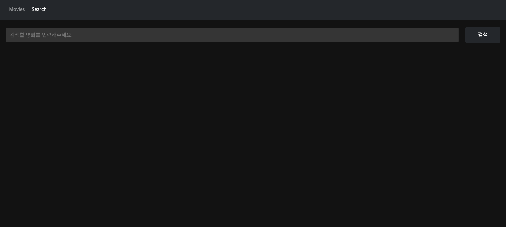
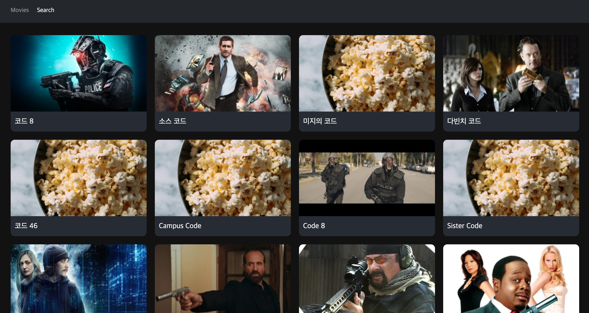

## API 작업

이제 검색 페이지를 만들어 보도록 하겠습니다. 페이지를 만들기 전 우선 API 작업을 하다록 하겠습니다. **api.js** 파일을 아래와 같이 수정해 주세요.

```
// api.js

import axios from 'axios';

axios.defaults.baseURL = 'https://api.themoviedb.org/3/';

export const movieGet = () => {
  // 서버에 요청을 보냄
  return axios.get('/movie/now_playing', {
    params: {
      api_key: '받은 API 키를 입력해 주세요.',
      language: 'ko',
    },
  });
};

export const detailGet = (id) => {
  return axios.get(`/movie/${id}`, {
    params: {
      api_key: '받은 API 키를 입력해 주세요.',
      language: 'ko',
    },
  });
};

export const movieSearch = (text) => {
  return axios.get(`/search/movie`, {
    params: {
      api_key: '받은 API 키를 입력해 주세요.',
      language: 'ko',
      query: encodeURIComponent(text),
    },
  });
};

```

## 화면 레이아웃 작업

위와 같이 작성 하셨다면 **containers** 폴더 안에 **SearchPage.js** 파일을 만들어 주고 아래와 같이 입력해 주세요.

```
// SearchPage.js

import React, { useState } from 'react';
import styled from 'styled-components';
import { movieSearch } from '../api';
import ItemList from '../components/ItemList';

const Form = styled.form`
  display: flex;
  align-items: center;
  justify-content: center;
`;

const Input = styled.input`
  display: block;
  flex: 1;
  background-color: rgba(255, 255, 255, 0.15);
  box-sizing: border-box;
  border: none;
  box-shadow: none;
  outline: none;
  color: #fff;
  padding: 0.75rem;
  font-size: 1rem;
  border-radius: 3px;
`;

const Button = styled.button`
  width: 100px;
  padding: 0.75rem;
  font-size: 1rem;
  border-radius: 3px;
  border: none;
  background-color: #24272b;
  color: #fff;
  font-size: 1rem;
  margin-left: 1.2rem;
`;

const ListBox = styled.ul`
  display: flex;
  flex-wrap: wrap;
`;

const List = styled.li`
  width: 100%;
  padding: 10px;
  box-sizing: border-box;
  @media screen and (min-width: 768px) {
    width: 33.33%;
  }

  @media screen and (min-width: 1200px) {
    width: 25%;
  }
`;

function SearchPage() {
  const [searchText, setSearchText] = useState('');
  const [lists, setLists] = useState('');
  const [searchResult, setSearchResult] = useState(false);

  const searchMovie = async () => {
    const res = await movieSearch(searchText);
    setLists(res.data.results);
    setSearchResult(true);
  };

  const onChangeSearchText = (e) => {
    setSearchText(e.target.value);
  };

  const onSubmitSearch = (e) => {
    e.preventDefault();
    searchMovie();
  };

  return (
    <>
      {!searchResult ? (
        <Form onSubmit={onSubmitSearch}>
          <Input
            type="text"
            placeholder="검색할 영화를 입력해주세요."
            value={searchText}
            onChange={onChangeSearchText}
          />
          <Button type="submit">검색</Button>
        </Form>
      ) : (
        <ListBox>
          {lists.length >= 1 &&
            lists.map((data) => (
              <List key={data.id}>
                <ItemList data={data} />
              </List>
            ))}
        </ListBox>
      )}
    </>
  );
}

export default SearchPage;

```

위와 같이 입력을 하셨다면 이제 화면에 보이도록 작업을 하도록 하겠습니다. **Search.js** 파일을 아래와 같이 수정해 주세요.

```
// Search.js

import React from 'react';
import SearchPage from '../containers/SearchPage';

const Search = () => {
  return (
    <>
      <SearchPage />
    </>
  );
};

export default Search;

```

위와 같이 수정을 하셨다면 아래 이미지 처럼 인풋과 버튼이 정상적으로 나오는 것을 확인 하실 수 있습니다.



그리고 code 를 입력하시고 검색버튼을 누르시면 아래 이미지처럼 영화가 검색 되는 것을 확인 하실 수 있습니다.



이것으로 무비웹앱을 한번 만들어 봤습니다만 아직 부족한 것이 많이 보입니다.
완성된 프로젝트는 [바로가기](https://dazzling-morse-0589ac.netlify.app/) 에서 확인 하실 수 있습니다.
