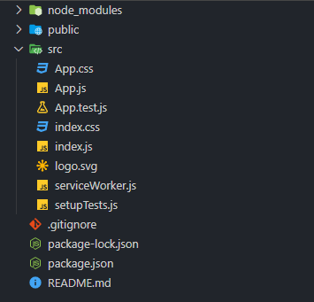
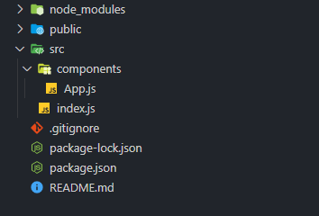

## React 프로젝트 만들기

이 프로젝트는 벨로퍼트님의 멋진 투두리스트 만들기를 따라 하였습니다. https://react.vlpt.us/mashup-todolist/  
react를 이용하여 To Do List 를 만들어 보겠습니다.

### React 설치

우선 터미널을 열고 프로젝트 작업공간으로 이동 후 create-react-app 을 사용하여 새로운 프로젝트를 만들어줍니다.

```
$ npx create-react-app todolist
```

해당 폴더에 들어가서 프로젝트에 필요한 라이브러리를 설치하겠습니다.
이번 프로젝트에는 styled-components , styled-reset , react-icons , mobx , mobx-react 를 이용하겠습니다.

```
$ cd todolist
$ npm i styled-components styled-reset react-icons mobx , mobx-react
```

설치 완료 후 터미널에서 **npm start** 를 하면 localhost:3000 열리면서 리액트 프로젝트가 실행 된 것을 확인 할 수 있습니다.
VSCode(다른 에디터도 가능) 를 열어 프로젝트의 파일을 보면 아래 이미지와 같이 되어있는 것을 확인 할 수 있습니다.

### 프로젝트 초기 작업



프로젝트를 만들기 전 우선 화면을 reset 시켜 빈화면을 만들고 프로젝트를 진행하도록 하겠습니다.



src 폴더 안에 components 폴더를 만들어 주고 App.js를 components 안에 넣어 주고 index.js , App.js 를 제외한 다른 파일들을 삭제합니다. 그리고 App.js 와 index.js 를 아래와 같이 수정 합니다.

```
// App.js
import React from 'react';

function App() {
  return (
    <>
      <div>React</div>
    </>
  );
}

export default App;

```

```
//index.js
import React from 'react';
import ReactDOM from 'react-dom';
import App from './components/App';

ReactDOM.render(
  <React.StrictMode>
    <App />
  </React.StrictMode>,
  document.getElementById('root')
);

```

다음으로 css reset을 해주도록 하겠습니다. components 폴더 안에 GlobalStyles.js 파일을 만들어 주고 아래와 같이 입력합니다.

```
import { createGlobalStyle } from 'styled-components';
import reset from 'styled-reset';
export const GlobalStyles = createGlobalStyle`
  ${reset};
  body {
    background-color: #e9ecef;
    color: rgb(55, 53, 47);
    font-size: 15px;
    font-weight: 400;
    line-height: 1.65;
  }
`;

export const palette = {
  white: 'rgba(255, 255, 255, 0.9)',
  black: 'rgb(55, 53, 47);'
};

```

App.js 파일을 **GlobalStyles** 를 import 시켜 적용합니다.

```
// App.js
import React from 'react';
import { GlobalStyles } from './GlobalStyles';

function App() {
  return (
    <>
      <GlobalStyles />
      <div>React</div>
    </>
  );
}

export default App;

```

이제 브라우저에서 css style 이 초기화 된 것을 확인 할 수 있습니다.
