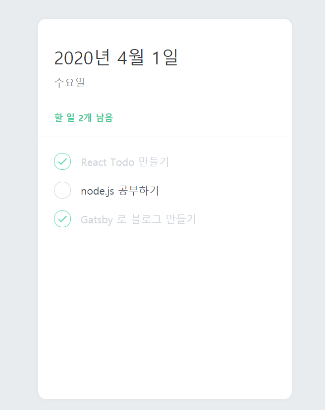
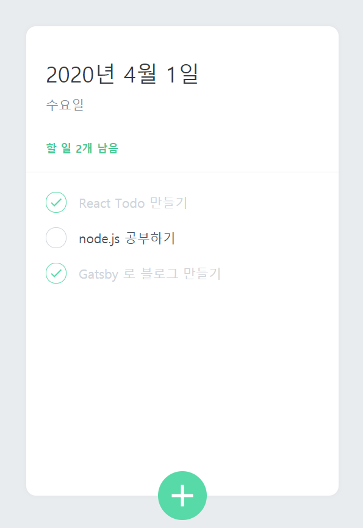
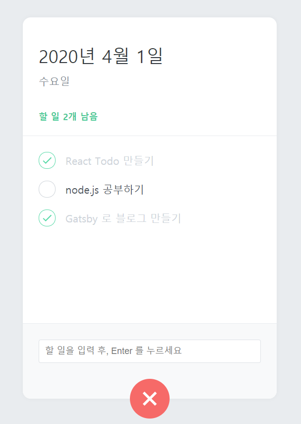

## 컴포넌트 만들기

이 프로젝트에는 5개의 컴포넌트를 만들겁니다. 만들기 전 각 컴포넌트의 역할을 알아보겠습니다.

#### TodoTemplate

이 컴포넌트는 우리가 만들 투두리스트의 레이아웃을 설정하는 컴포넌트입니다. 페이지의 중앙에 그림자가 적용된 흰색 박스를 보여줍니다.

#### TodoHead

이 컴포넌트는 오늘의 날짜와 요일을 보여주고, 앞으로 해야 할 일이 몇개 남았는지 보여줍니다.

#### TodoList

이 컴포넌트는 할 일에 대한 정보가 들어있는 todos 배열을 내장함수 map 을 사용하여 여러개의 TodoItem 컴포넌트를 렌더링해줍니다.

#### TodoItem

각 할 일에 대한 정보를 렌더링해주는 컴포넌트입니다. 좌측에 있는 원을 누르면 할 일의 완료 여부를 toggle 할 수 있습니다. 할 일이 완료됐을 땐 좌측에 체크가 나타나고 텍스트의 색상이 연해집니다. 그리고, 마우스를 올리면 휴지통 아이콘이 나타나고 이를 누르면 항목이 삭제됩니다.

#### TodoCreate

새로운 할 일을 등록할 수 있게 해주는 컴포넌트입니다. TodoTemplate 의 하단부에 초록색 원 버튼을 렌더링해주고, 이를 클릭하면 할 일을 입력 할 수 있는 폼이 나타납니다. 버튼을 다시 누르면 폼이 사라집니다.

### TodoTemplate 만들기

TodoTemplate 컴포넌트를 만들어서 중앙에 정렬된 흰색 박스를 보여줘봅시다. **components** 폴더 안에 **TodoTemplate.js** 를 만드세요. 앞으로 만들 컴포넌트들은 모두 **components** 폴더에 만들도록 하겠습니다.

```
// TodoTemplate.js
import React from 'react';
import styled from 'styled-components';

const TodoTemplateBlock = styled.div`
  width: 512px;
  height: 768px;

  position: relative; /* 추후 박스 하단에 추가 버튼을 위치시키기 위한 설정 */
  background: white;
  border-radius: 16px;
  box-shadow: 0 0 8px 0 rgba(0, 0, 0, 0.04);

  margin: 0 auto; /* 페이지 중앙에 나타나도록 설정 */

  margin-top: 96px;
  margin-bottom: 32px;
  display: flex;
  flex-direction: column;
`;

function TodoTemplate({ children }) {
  return (
    <>
      <TodoTemplateBlock>{children}</TodoTemplateBlock>
    </>
  );
}

export default TodoTemplate;

```

다 작성하셨으면 이 컴포넌트를 App.js 에서 불러와 렌더링 하겠습니다.

```
// App.js
import React from 'react';
import { GlobalStyles } from './GlobalStyles';
import TodoTemplate from './TodoTemplate';

function App() {
  return (
    <>
      <GlobalStyles />
      <TodoTemplate>Todo List 작업</TodoTemplate>
    </>
  );
}

export default App;

```


위 이미지처럼 흰 박스가 나왔다면 컴포넌트를 만들고 불러오는데 성공한 것 입니다.

### TodoHead 만들기

이 컴포넌트에서는 오늘의 날짜, 요일, 그리고 남은 할 일 개수를 보여주도록 하겠습니다.
**TodoHead.js** 파일을 만들어 주고 아래와 같이 입력해주세요.

```
// TodoHead
import React from 'react';
import styled from 'styled-components';

const TodoHeadContainer = styled.div`
  padding-top: 48px;
  padding-left: 32px;
  padding-right: 32px;
  padding-bottom: 24px;
  border-bottom: 1px solid #e9ecef;
`;

const Title = styled.h1`
  margin: 0;
  font-size: 36px;
  color: #343a40;
`;

const DateBox = styled.div`
  margin-top: 4px;
  color: #868e96;
  font-size: 21px;
`;

const TasksList = styled.div`
  color: #20c997;
  font-size: 18px;
  margin-top: 40px;
  font-weight: bold;
`;

const TodoHead = () => {
  return (
    <>
      <TodoHeadContainer>
        <Title>2020년 4월 1일</Title>
        <DateBox>수요일</DateBox>
        <TasksList>할 일 2개 남음</TasksList>
      </TodoHeadContainer>
    </>
  );
};

export default TodoHead;
```

위처럼 작성하셨다면 이 컴포넌트를 App.js 에서 불러오도록 하겠습니다.

```
// App.js
import React from 'react';
import { GlobalStyles } from './GlobalStyles';
import TodoTemplate from './TodoTemplate';
import TodoHead from './TodoHead';

function App() {
  return (
    <>
      <GlobalStyles />
      <TodoTemplate>
        <TodoHead />
        Todo List 작업
      </TodoTemplate>
    </>
  );
}

export default App;

```

### TodoList 만들기

여러개의 할 일 목록을 보여주게 될 TodoList 를 만들어보겠습니다.
**ToDoList.js** 파일을 만들어 주시고 아래와 같이 입력해주세요.

```
// TodoList.js
import React from 'react';
import styled from 'styled-components';

const TodoListContainer = styled.div`
  flex: 1;
  padding: 20px 32px;
  padding-bottom: 48px;
  overflow-y: auto;
`;

const TodoList = () => {
  return <TodoListContainer>TodoList</TodoListContainer>;
};

export default TodoList;

```

작성이 끝났다면 아까처럼 App.js 에서 불러와보도록 하겠습니다.

```
// App.js
import React from 'react';
import { GlobalStyles } from './GlobalStyles';
import TodoTemplate from './TodoTemplate';
import TodoHead from './TodoHead';
import TodoList from './TodoList';

function App() {
  return (
    <>
      <GlobalStyles />
      <TodoTemplate>
        <TodoHead />
        <TodoList />
      </TodoTemplate>
    </>
  );
}

export default App;

```

### TodoItem 만들기

이제 각 할 일들을 보여주는 TodoItem 컴포넌트를 만들어 보겠습니다.
**TodoItem.js** 파일을 만들어 주고 아래와 같이 입력해주세요.

```
// TodoItem.js
import React from 'react';
import styled, { css } from 'styled-components';
import { MdDone, MdDelete } from 'react-icons/md';

const Remove = styled.div`
  display: flex;
  align-items: center;
  justify-content: center;
  color: #dee2e6;
  font-size: 24px;
  cursor: pointer;
  &:hover {
    color: #ff6b6b;
  }
  display: none;
`;

const TodoItemContainer = styled.div`
  display: flex;
  align-items: center;
  padding-top: 12px;
  padding-bottom: 12px;
  &:hover {
    ${Remove} {
      display: initial;
    }
  }
`;

const CheckCircle = styled.div`
  width: 32px;
  height: 32px;
  border-radius: 16px;
  border: 1px solid #ced4da;
  font-size: 24px;
  display: flex;
  align-items: center;
  justify-content: center;
  margin-right: 20px;
  cursor: pointer;
  ${props =>
    props.done &&
    css`
      border: 1px solid #38d9a9;
      color: #38d9a9;
    `}
`;

const Text = styled.div`
  flex: 1;
  font-size: 21px;
  color: #495057;
  ${props =>
    props.done &&
    css`
      color: #ced4da;
    `}
`;

const TodoItem = ({ id, done, text }) => {
  return (
    <>
      <TodoItemContainer>
        <CheckCircle done={done}>{done && <MdDone />}</CheckCircle>
        <Text done={done}>{text}</Text>
        <Remove>
          <MdDelete />
        </Remove>
      </TodoItemContainer>
    </>
  );
};

export default TodoItem;

```

TodoItemContainer 컴포넌트 마우스가 호버 했을때 Remove 컴포넌트를 보여주기 위해

```
&:hover {
  ${Remove} {
    display: initial;
  }
}
```

를 적었고 Remove 컴포넌트를 TodoItemContainer 위에 적었습니다. 만약 Remove 컴포넌트를 아래에 작성하면 TodoItemContainer 에서 Remove 를 찾지를 못하고 오류가 발생하니 꼭 위에 적어주세요.

이제 위에서 작성한 코드를 **TodoList.js** 에서 불러와 보도록 하겠습니다.

```
// TodoList.js
import React from 'react';
import styled from 'styled-components';
import TodoItem from './TodoItem';

const TodoListContainer = styled.div`
  flex: 1;
  padding: 20px 32px;
  padding-bottom: 48px;
  overflow-y: auto;
`;

const TodoList = () => {
  return (
    <TodoListContainer>
      <TodoItem text="React Todo 만들기" done={true} />
      <TodoItem text="node.js 공부하기" done={false} />
      <TodoItem text="Gatsby 로 블로그 만들기" done={true} />
    </TodoListContainer>
  );
};

export default TodoList;

```



위 이미지처럼 각 리스트 들이 잘 나오고 있는지 확인해 주세요.

#### TodoCreate 만들기

다음으로 만들 컴포넌트는 새로운 할 일을 등록하게 해주는 컴포넌트를 만들도록 하겠습니다.  
이 컴포넌트에서는 **useState** 를 사용하여 토글 버튼을 할 수 있도록 해줄 것이며 버튼을 눌러 할 일을 입력 할 수 있는 폼을 보여주도록 하겠습니다.

**TodoCreate.js** 파일을 만들어 주고 아래와 같이 입력해주세요.

```
import React, { useState } from 'react';
import styled, { css } from 'styled-components';
import { MdAdd } from 'react-icons/md';

const CircleButton = styled.button`
  background: #38d9a9;
  &:hover {
    background: #63e6be;
  }
  &:active {
    background: #20c997;
  }

  z-index: 5;
  cursor: pointer;
  width: 80px;
  height: 80px;
  display: block;
  align-items: center;
  justify-content: center;
  font-size: 60px;
  position: absolute;
  left: 50%;
  bottom: 0px;
  transform: translate(-50%, 50%);
  color: white;
  border-radius: 50%;
  border: none;
  outline: none;
  display: flex;
  align-items: center;
  justify-content: center;

  transition: 0.125s all ease-in;
  ${props =>
    props.open &&
    css`
      background: #ff6b6b;
      &:hover {
        background: #ff8787;
      }
      &:active {
        background: #fa5252;
      }
      transform: translate(-50%, 50%) rotate(45deg);
    `}
`;

const InsertFormPositioner = styled.div`
  width: 100%;
  bottom: 0;
  left: 0;
  position: absolute;
`;

const InsertForm = styled.form`
  background: #f8f9fa;
  padding-left: 32px;
  padding-top: 32px;
  padding-right: 32px;
  padding-bottom: 72px;

  border-bottom-left-radius: 16px;
  border-bottom-right-radius: 16px;
  border-top: 1px solid #e9ecef;
`;

const Input = styled.input`
  padding: 12px;
  border-radius: 4px;
  border: 1px solid #dee2e6;
  width: 100%;
  outline: none;
  font-size: 18px;
  box-sizing: border-box;
`;

const TodoCreate = () => {
  const [open, setOpen] = useState(false);

  const onToggle = () => setOpen(!open);
  return (
    <>
      {open && (
        <InsertFormPositioner>
          <InsertForm>
            <Input autoFocus placeholder="할 일을 입력 후, Enter 를 누르세요" />
          </InsertForm>
        </InsertFormPositioner>
      )}
      <CircleButton onClick={onToggle} open={open}>
        <MdAdd />
      </CircleButton>
    </>
  );
};

export default TodoCreate;

```

위에서 만든 컴포넌트를 이제 App.js 에서 불러와 보도록 하겠습니다.

```
// App.js
import React from 'react';
import { GlobalStyles } from './GlobalStyles';
import TodoTemplate from './TodoTemplate';
import TodoHead from './TodoHead';
import TodoList from './TodoList';
import TodoCreate from './TodoCreate';

function App() {
  return (
    <>
      <GlobalStyles />
      <TodoTemplate>
        <TodoHead />
        <TodoList />
        <TodoCreate />
      </TodoTemplate>
    </>
  );
}

export default App;

```

플러스 버튼을 누르면 UI가 잘 바뀌는 것을 확인 할 수 있습니다.




