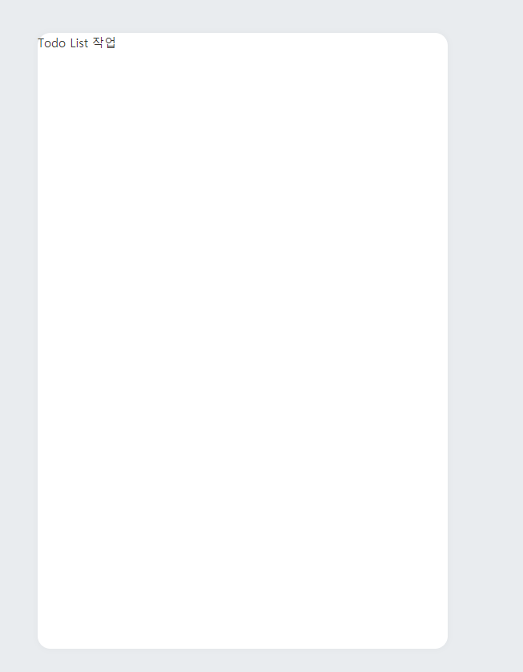

## 컴포넌트 만들기

이 프로젝트에는 5개의 컴포넌트를 만들겁니다. 만들기 전 각 컴포넌트의 역할을 알아보겠습니다.

#### TodoTemplate

이 컴포넌트는 우리가 만들 투두리스트의 레이아웃을 설정하는 컴포넌트입니다. 페이지의 중앙에 그림자가 적용된 흰색 박스를 보여줍니다.

#### TodoHead

이 컴포넌트는 오늘의 날짜와 요일을 보여주고, 앞으로 해야 할 일이 몇개 남았는지 보여줍니다.

#### TodoList

이 컴포넌트는 할 일에 대한 정보가 들어있는 todos 배열을 내장함수 map 을 사용하여 여러개의 TodoItem 컴포넌트를 렌더링해줍니다.

#### TodoItem

각 할 일에 대한 정보를 렌더링해주는 컴포넌트입니다. 좌측에 있는 원을 누르면 할 일의 완료 여부를 toggle 할 수 있습니다. 할 일이 완료됐을 땐 좌측에 체크가 나타나고 텍스트의 색상이 연해집니다. 그리고, 마우스를 올리면 휴지통 아이콘이 나타나고 이를 누르면 항목이 삭제됩니다.

#### TodoCreate

새로운 할 일을 등록할 수 있게 해주는 컴포넌트입니다. TodoTemplate 의 하단부에 초록색 원 버튼을 렌더링해주고, 이를 클릭하면 할 일을 입력 할 수 있는 폼이 나타납니다. 버튼을 다시 누르면 폼이 사라집니다.

### TodoTemplate 만들기

TodoTemplate 컴포넌트를 만들어서 중앙에 정렬된 흰색 박스를 보여줘봅시다. **components** 폴더 안에 **TodoTemplate.js** 를 만드세요. 앞으로 만들 컴포넌트들은 모두 **components** 폴더에 만들도록 하겠습니다.

```
// TodoTemplate.js
import React from 'react';
import styled from 'styled-components';

const TodoTemplateBlock = styled.div`
  width: 512px;
  height: 768px;

  position: relative; /* 추후 박스 하단에 추가 버튼을 위치시키기 위한 설정 */
  background: white;
  border-radius: 16px;
  box-shadow: 0 0 8px 0 rgba(0, 0, 0, 0.04);

  margin: 0 auto; /* 페이지 중앙에 나타나도록 설정 */

  margin-top: 96px;
  margin-bottom: 32px;
  display: flex;
  flex-direction: column;
`;

function TodoTemplate({ children }) {
  return (
    <>
      <TodoTemplateBlock>{children}</TodoTemplateBlock>
    </>
  );
}

export default TodoTemplate;

```

다 작성하셨으면 이 컴포넌트를 App.js 에서 불러와 렌더링 하겠습니다.

```
// App.js
import React from 'react';
import { GlobalStyles } from './GlobalStyles';
import TodoTemplate from './TodoTemplate';

function App() {
  return (
    <>
      <GlobalStyles />
      <TodoTemplate>Todo List 작업</TodoTemplate>
    </>
  );
}

export default App;

```



위 이미지처럼 흰 박스가 나왔다면 컴포넌트를 만들고 불러오는데 성공한 것 입니다.
